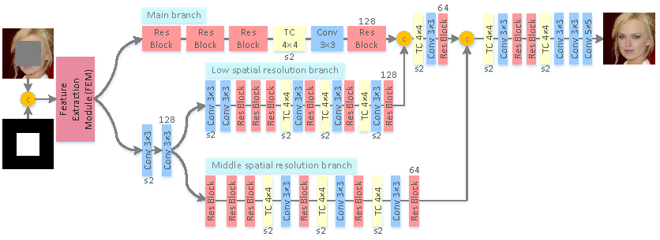

# MLGN
PyTorch code for the paper: "Facial image inpainting using multi-level generative network"

The code is coming soon.
### Dependencies
PyTorch 0.3

Python 3.5

### Architecture and Results
<p align="center">
  
</p>
The generative architecture of MLGN.

<p align="center">
  
</p>
The results of MLGN (CelebA and CelebA-HQ).


## Reference
```
@inproceedings{facial2019mlgn,
	title={Facial image inpainting using multi-level generative network},
	author={Liu, Jie and Jung, Cheolkon},
	booktitle={IEEE International Conference on Multimedia and Expo (ICME)},
	year={2019}
}
```
